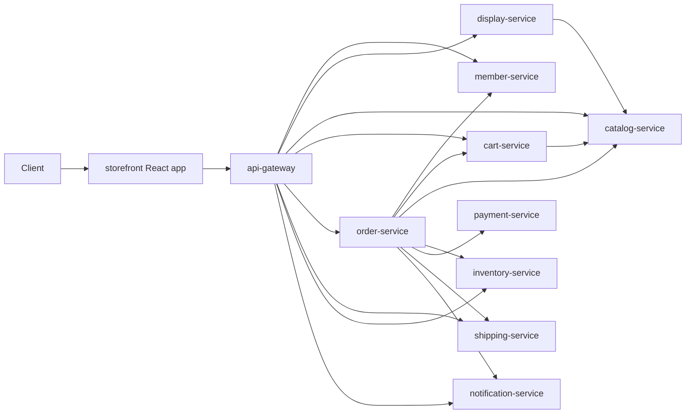
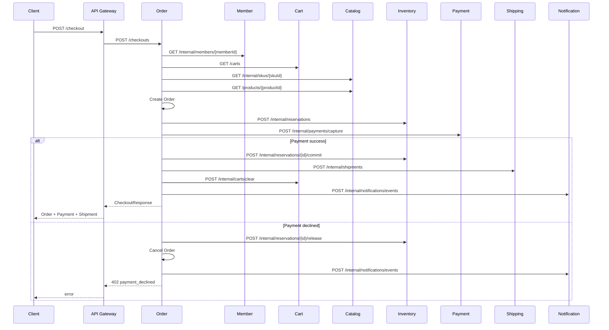

# Architecture

## System View



### 경로의 두 등급

**게이트웨이가 브라우저에 노출하는 경로와 그렇지 않은 경로를 프리픽스로 나눈다.** 노출하지 않을 경로는 각 서비스의 `/internal` 아래에 있고 `Internal*Controller`가 담는다.

이 구분은 등급을 **선언**할 뿐 아무것도 막지 않는다. 실제로 막는 것은 배포 토폴로지다 — 게이트웨이만 퍼블릭 인그레스에 두고 나머지는 프라이빗망에 둔다. 왜 앱이 아니라 네트워크가 막는지는 [ADR-0002](adr/0002-network-segmentation-as-trust-boundary.md), 왜 어노테이션이 아니라 경로로 선언하는지는 [ADR-0003](adr/0003-internal-path-prefix.md)에 있다.

기준은 "누가 부르는가"가 아니라 **"게이트웨이가 노출하는가"**다. 게이트웨이 자신이 `/internal/members/sessions/resolve`를 부르고, `/carts`와 `/products`는 게이트웨이와 형제 서비스가 함께 부른다.

## Checkout Saga



## Project Architecture

각 마이크로서비스는 다음 모양을 따릅니다.

```text
apps/<service>/
  src/main/java/com/impati/commerce/<domain>/
    <Service>Application.java
    domain/                 # aggregate, entity, value object
    application/            # use case, 출력 포트, 매퍼
    adapter/in/web/         # REST controller
    adapter/out/client/     # downstream HTTP client
    adapter/out/persistence/# repository adapter
    adapter/out/mail/       # 메일 발송 구현
    adapter/out/security/   # 해싱, 토큰 생성
    support/                # exception handler 등
```

공통 모듈은 둘입니다. `libs/common-contracts`에는 서비스 간 HTTP DTO, 공통 예외, ID 생성기만 있고 도메인 모델은 넣지 않았습니다 — 도메인 모델을 공유하면 마이크로서비스 경계가 약해집니다. `libs/common-http`에는 서비스 간 호출의 공통 정책(타임아웃)이 auto-configuration으로 들어 있습니다.

### application 패키지에는 네 종류가 있다

`application`은 "응용 계층"이지 "응용 서비스"가 아닙니다. 네 가지가 함께 삽니다.

| 종류 | 이름 규약 | 무엇인가 |
| --- | --- | --- |
| 유스케이스 | `XxxService` (`@Service`) | 흐름을 조율하고 트랜잭션 경계를 만듭니다. 결정은 도메인에 위임하고 스스로 규칙을 갖지 않습니다 |
| 출력 포트 | `XxxRepository`, `XxxClient`, 능력 이름 | 애플리케이션이 외부에 요구하는 계약. 구현은 `adapter/out` |
| 매퍼 | `XxxMapper` | 도메인 ↔ 계약 변환. 도메인이 계약을 모르게 하는 것이 목적입니다 |
| 구동자 | — | 스케줄러나 앱 시작이 트리거인 진입점. **여기 있어서는 안 됩니다** (아래) |

**포트가 왜 `application`에 있는가.** 인터페이스의 소유자가 애플리케이션이기 때문입니다. 애플리케이션이 "나는 이런 능력이 필요하다"고 선언하고 어댑터가 그것을 구현합니다. 인터페이스를 어댑터 옆에 두면 `application → adapter` 의존이 생겨 의존 방향이 뒤집히고, 구현을 갈아끼우려고 포트를 둔 이유가 사라집니다. 그래서 인터페이스는 항상 안쪽에 있습니다.

포트는 세 갈래이고 이름이 다릅니다.

- `XxxRepository` — 우리가 소유한 상태. 같은 서비스의 데이터입니다
- `XxxClient` — 다른 서비스. 프로토콜 오류를 도메인 언어로 옮기는 것도 어댑터의 일입니다 (402 → `paymentDeclined`)
- 능력 이름 (`PasswordHasher`, `SecureTokens`, `MailSender`) — 기술 수단. **이름에 수단을 넣지 않습니다.** `BCryptHasher`가 아니라 `PasswordHasher`입니다. 구현이 Argon2로 바뀌어도 포트 이름은 그대로여야 하고, 수단이 이름에 박히면 갈아끼울 때 호출하는 쪽이 전부 바뀝니다

**구동자는 `application`에 있어서는 안 됩니다.** `OutboxDispatcher`는 `notifications.dispatchPending()`만 부르고 로직이 없습니다. `LocalDemoSeeder`는 앱 시작이 트리거입니다. 둘 다 애플리케이션을 바깥에서 호출하는 진입점이며 HTTP 컨트롤러와 역할이 같습니다. 컨트롤러가 `adapter/in/web`에 있으므로 이들도 `adapter/in` 아래 있어야 합니다.

### 커지면 어떤 순서로 나누는가

member-service의 `application`이 11개로 가장 큽니다 — 유스케이스 3, 포트 6, 매퍼 1, 구동자 1. 지금은 이름만으로 구분되고 있어서 파일 목록을 눈으로 훑어야 종류를 압니다.

기준은 파일 수가 아니라 **종류가 구조로 보이는가**입니다. 순서는 이렇습니다.

1. **포트를 `application/port`로 뺀다.** 열 서비스 모두 같은 모양으로 합니다 — 서비스마다 구조가 다르면 그게 더 비쌉니다. "저장소는 포트로만 쓴다"는 규칙이 이름 규약에서 패키지 구조로 올라갑니다. `port/in`은 만들지 않습니다. 입력 포트는 유스케이스 자신이므로 영원히 비어 있을 디렉터리입니다
2. **구동자를 `adapter/in`으로 옮긴다.** 스케줄러는 `adapter/in/scheduler`
3. **유스케이스가 한 서비스에 다섯 개를 넘으면 기능별로 나눈다** (`application/registration/`). 지금은 세 개가 최대이므로 이릅니다

유스케이스별로 먼저 나누지 않는 이유는 여러 유스케이스가 같은 포트를 쓰기 때문입니다. 기능별로 먼저 쪼개면 포트를 어디 둘지가 애매해집니다.

## Transaction Boundary

강한 일관성은 각 서비스 내부 aggregate에만 둡니다. checkout은 분산 트랜잭션이 아니라 saga입니다.

- 재고 예약 성공 후 결제 실패: inventory reservation release
- 결제 성공 후 배송 생성 성공: inventory reservation commit, order fulfilling
- 배송 완료: shipping delivered 후 order delivered

## Next Production Steps

- 서비스별 DB 분리
- Kafka 같은 broker를 통한 domain event 발행
- outbox pattern
- idempotency key for checkout/payment
- Resilience4j retry/circuit breaker
- OpenTelemetry tracing
- Spring Security/OAuth2
- contract test와 consumer-driven contract
