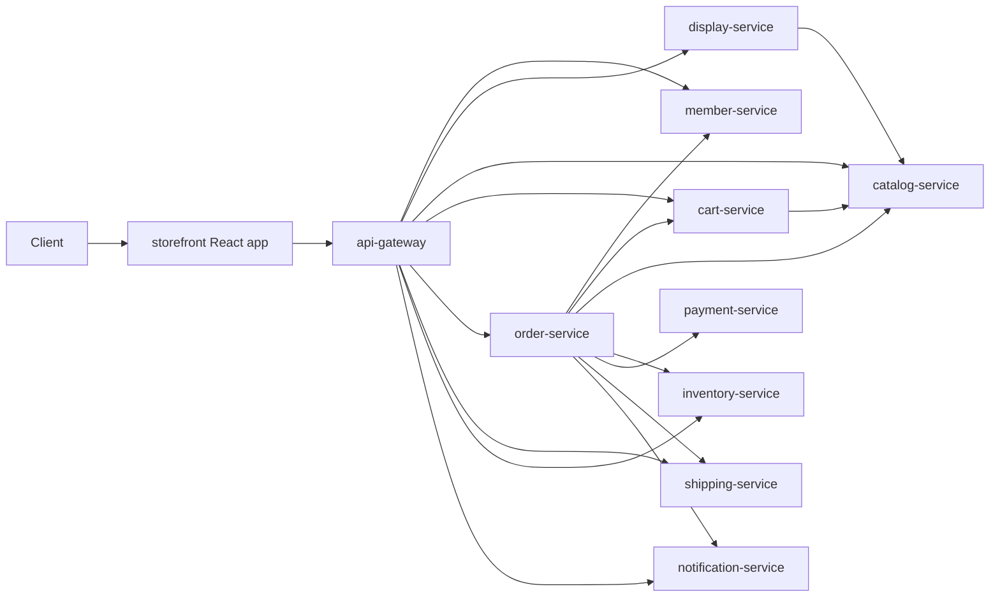
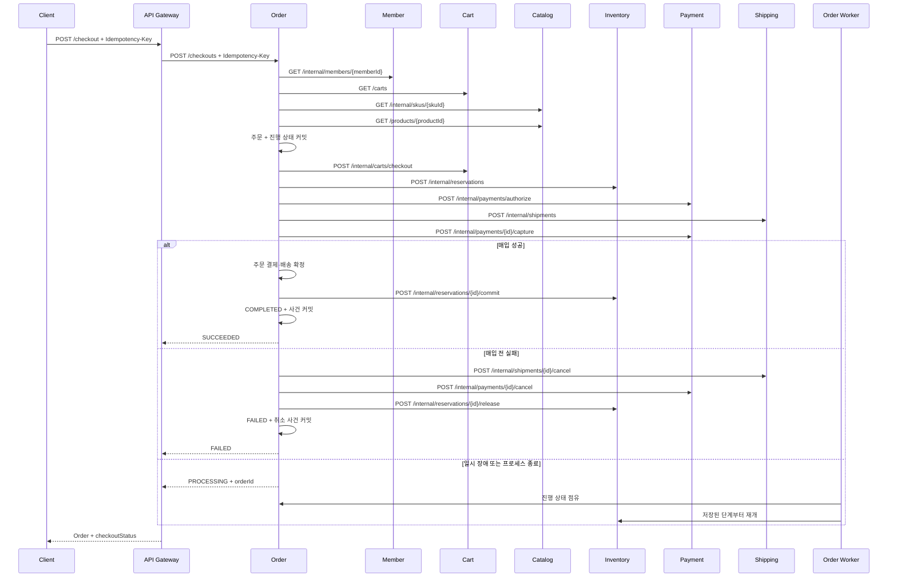
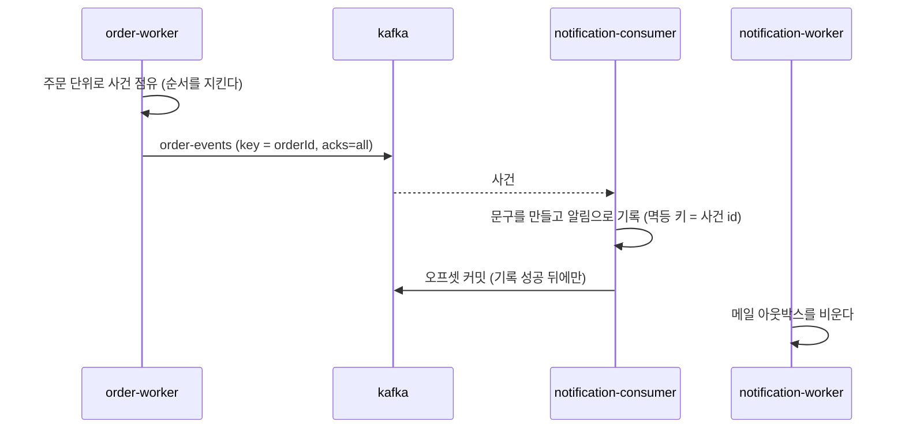

# Architecture

## System View



### 경로의 두 등급

**게이트웨이가 브라우저에 노출하는 경로와 그렇지 않은 경로를 프리픽스로 나눈다.** 노출하지 않을 경로는 각 서비스의 `/internal` 아래에 있고 `Internal*Controller`가 담는다.

이 구분은 등급을 **선언**할 뿐 아무것도 막지 않는다. 실제로 막는 것은 배포 토폴로지다 — 게이트웨이만 퍼블릭 인그레스에 두고 나머지는 프라이빗망에 둔다. 왜 앱이 아니라 네트워크가 막는지는 [ADR-0002](adr/0002-network-segmentation-as-trust-boundary.md), 왜 어노테이션이 아니라 경로로 선언하는지는 [ADR-0003](adr/0003-internal-path-prefix.md)에 있다.

기준은 "누가 부르는가"가 아니라 **"게이트웨이가 노출하는가"**다. 게이트웨이 자신이 `/internal/members/sessions/refresh`를 부르고, `/carts`와 `/products`는 게이트웨이와 형제 서비스가 함께 부른다.

## Checkout Saga

API가 정상 체크아웃을 실행하고 각 외부 호출 사이의 진행 단계를 주문 DB에 저장한다. API가 끝까지 가지 못하면 `PROCESSING`과 주문 식별자를 반환하고, order-worker가 같은 진행 레코드를 점유해 중단된 단계부터 이어간다. 점유 세대가 지난 실행자의 늦은 저장을 막는다 ([PD-0017](policy/pd-0017-checkout-execution-and-recovery.md), [ADR-0018](adr/0018-durable-checkout-recovery.md)).

외부 생성 요청은 주문 식별자에 대해 멱등하다. 응답을 받지 못하면 같은 요청을 즉시 한 번 반복한다. 매입 전 실패는 배송 취소·승인 취소·예약 해제로 정리하고, 매입이 확인된 뒤에는 주문과 재고 확정을 앞으로 진행한다. 매입 결과가 계속 불명이면 결제 상태를 조회해 승인 취소나 환불을 결정한다.



알림은 이 흐름 안에 없다. 주문은 사건을 아웃박스에 커밋하고 끝나며, 그 뒤는 비동기다
([ADR-0012](adr/0012-order-events-as-outbox.md), [ADR-0016](adr/0016-publish-order-events-to-kafka.md)).



**주문은 누가 소비하는지 모른다.** 소비자를 늘리는 것이 발신자의 변경이 아니며, 알림이 없는
사건이 있는 것도 정상이다 — 사건을 남기는 기준은 소비자가 아니라 상태 전이다.

## Project Architecture

각 마이크로서비스는 다음 모양을 따릅니다.

```text
apps/<service>/
  src/main/java/com/impati/commerce/<domain>/
    <Service>Application.java
    domain/                 # aggregate, entity, value object
    application/port/in/    # 유스케이스와 그 입출력 타입
    application/port/out/   # 저장소·클라이언트·능력 포트
    application/component/  # 유스케이스 구현과 매퍼
    adapter/in/web/         # REST controller
    adapter/in/scheduler/   # 스케줄러 진입점
    adapter/in/seed/        # 데모 시드 진입점
    adapter/out/client/     # downstream HTTP client
    adapter/out/persistence/# repository adapter
    adapter/out/mail/       # 메일 발송 구현
    adapter/out/gateway/    # 결제 대행사 구현
    adapter/out/security/   # 해싱, 토큰 생성
    support/                # exception handler 등
```

공통 모듈은 둘입니다. `libs/common-contracts`에는 서비스 간 HTTP DTO, 공통 예외, ID 생성기만 있고 도메인 모델은 넣지 않았습니다 — 도메인 모델을 공유하면 마이크로서비스 경계가 약해집니다. `libs/common-http`에는 서비스 간 호출의 공통 정책(타임아웃)이 auto-configuration으로 들어 있습니다.

### application 패키지는 셋으로 나뉜다

`application`은 "응용 계층"이지 "응용 서비스"가 아닙니다. 세 자리가 이름으로 갈립니다.

```text
application/
  port/in/     유스케이스와 그 입출력 타입   ← 무엇을 할 수 있나
  port/out/    저장소·클라이언트·능력 포트    ← 바깥에 무엇을 요구하나
  component/   구현과 매퍼                  ← 그것을 실행하는 것
```

| 자리 | 이름 규약 | 무엇인가 |
| --- | --- | --- |
| 유스케이스 | `XxxUseCase` | 이 서비스로 할 수 있는 일 전부. 인바운드 어댑터가 보는 면입니다 |
| 입출력 타입 | `XxxDetails`, `NewXxx` 등 | 유스케이스가 주고받는 것. **이름이 무엇인지 말하게 합니다** — 접미사를 기계적으로 붙이지 않습니다 |
| 출력 포트 | `XxxRepository`, `XxxClient`, 능력 이름 | 애플리케이션이 외부에 요구하는 계약. 구현은 `adapter/out` |
| 구현 | `XxxExecutor` (`@Component`) | 흐름을 조율하고 트랜잭션 경계를 만듭니다. 결정은 도메인에 위임하고 불변식을 갖지 않습니다 — 응용 계층에 있는 불변식은 강제되지 않으므로, 애그리거트로 지킬 수 없어 다른 강제 수단(DB 제약)을 함께 둘 때만 여기 둡니다 |
| 매퍼 | `XxxMapper` | 도메인 ↔ 유스케이스 입출력. **package-private입니다** |
| 구동자 | — | 스케줄러나 앱 시작이 트리거인 진입점. **여기 있어서는 안 됩니다** (아래) |

**왜 `Service`가 아닌가.** `Service`는 이 저장소에서 유스케이스, 도메인 서비스, 그냥 스프링 빈 셋 중 무엇이든 될 수 있어 아무것도 알려주지 않습니다. `port/in`이 계약이고 `component`가 그것을 실행하는 것이라는 대비가 이름에 드러나야 합니다.

### 포트

**포트가 왜 `application`에 있는가.** 인터페이스의 소유자가 애플리케이션이기 때문입니다. 애플리케이션이 "나는 이런 능력이 필요하다"고 선언하고 어댑터가 그것을 구현합니다. 인터페이스를 어댑터 옆에 두면 `application → adapter` 의존이 생겨 의존 방향이 뒤집히고, 구현을 갈아끼우려고 포트를 둔 이유가 사라집니다.

출력 포트는 세 갈래이고 이름이 다릅니다.

- `XxxRepository` — 우리가 소유한 상태. 같은 서비스의 데이터입니다
- `XxxClient` — 다른 서비스. 프로토콜 오류를 도메인 언어로 옮기는 것도 어댑터의 일입니다 (402 → `paymentDeclined`)
- 능력 이름 (`PasswordHasher`, `SecureTokens`, `MailSender`, `PaymentGateway`) — 기술 수단. **이름에 수단을 넣지 않습니다.** `BCryptHasher`가 아니라 `PasswordHasher`입니다. 구현이 Argon2로 바뀌어도 포트 이름은 그대로여야 하고, 수단이 이름에 박히면 갈아끼울 때 호출하는 쪽이 전부 바뀝니다

**포트 필드 이름은 타입 이름의 camelCase입니다.** `orderRepository`, `paymentClient`, `paymentGateway`, `mailSender`. 예외를 두지 않는 이유는 **호출부에서 경계가 보여야** 하기 때문입니다.

```java
orderRepository.save(order);                    // 네트워크를 넘지 않는다
paymentClient.authorizePayment(request);        // 넘는다 — 타임아웃·부분 실패·보상이 따라붙는다
```

이전에는 복수 도메인 명사(`orders`, `payments`)를 썼습니다. 선언부에는 타입이 있으니 모호하지 않지만, 호출부의 `payments.capturePayment(...)`만 보면 그것이 자기 DB인지 다른 서비스인지 알 수 없었습니다. 능력 포트(`mailSender`, `passwordHasher`)는 원래 이 규칙을 따르고 있었으므로, 통일하면 예외가 사라집니다.

api-gateway가 들고 있는 `RestClient`는 이 규칙의 대상이 아닙니다. 포트가 아니라 원시 클라이언트이고, 한 클래스가 대상 서비스별로 여러 개를 들고 있어 대상 이름으로 구분합니다.

**`port/in`은 의존 방향 때문에 있는 것이 아닙니다.** 들어오는 쪽은 어댑터가 응용을 부르므로 방향이 이미 맞습니다. 이 서비스로 무엇을 할 수 있는지를 한 타입이 알려주고, 컨트롤러가 구현이 아니라 계약에 의존하게 하려는 것입니다. 그래서 계약 문서는 포트에, 구현 사정은 구현 클래스에 적습니다.

**포트는 하나의 대화이지 하나의 동작이 아닙니다.** `PaymentUseCase` 하나가 승인·매입·취소·환불·조회 다섯을 담습니다. 동작마다 인터페이스를 만들면 얻는 것("호출하는 쪽이 자기가 쓰는 것만 안다")은 **소비자가 갈릴 때만** 생깁니다. 실제로 쪼개 봤더니 컨트롤러 하나가 다섯을 전부 써서 같은 빈이 다섯 번 주입되고 생성자만 길어졌습니다. 같은 기준이 출력 포트에도 적용됩니다 — 유스케이스마다 필요한 것만 선언하면(consumer-owned) 요구가 정확히 드러나지만 같은 시그니처가 여러 곳에 중복 선언됩니다. 능력 단위로 두고 압력이 올 때 쪼갭니다.

### 유스케이스는 서비스 간 계약을 돌려주지 않는다

`ApiContracts`의 타입은 서비스 사이에서 주고받는 것인데, 유스케이스의 반환값은 그렇지 않습니다. 인바운드 어댑터가 늘어나면 스케줄러나 메시지 소비자가 HTTP 계약을 받게 되는데 보낼 데가 없습니다 — notification-service는 컨트롤러와 스케줄러 둘이라 실제로 그렇습니다. 그래서 유스케이스가 자기 입출력 타입을 갖고, 각 어댑터가 자기 표현으로 옮깁니다.

**그 덕에 안팎이 다른 것을 담을 수 있습니다.** 대행사 거래 식별자는 payment의 결과 타입에는 있고 HTTP 계약에는 없습니다. 대사에 쓰는 내부 값이라 형제 서비스도 브라우저도 쓸 일이 없습니다 — 예전에는 `PaymentResponse`에 담겨 브라우저까지 나갔습니다.

**동작마다 타입을 나눌지는 상황 판단입니다.** payment는 다섯으로 나눴습니다 — 승인에 할부가 붙어도 매입은 안 건드리게 하려는 것입니다. 나머지 서비스는 하나로 뒀습니다. 필드가 완전히 같은데 미리 나누면 중복만 늘고, 실제로 갈릴 때 나누면 됩니다. **기계적인 규칙으로 만들지 않습니다.**

**나가는 방향의 계약은 그대로 둡니다.** `AuthorizePaymentRequest`나 `MemberResponse`처럼 형제 서비스와 주고받는 것은 실제로 서비스 사이에서 오가므로 계약 타입이 맞는 통화입니다. `Money`도 공용 값 타입으로 그대로 씁니다.

### 매퍼는 두 타입을 모두 알아도 되는 계층에 산다

매퍼가 둘로 갈리는 것이 이 구조의 결과입니다.

| 변환 | 두 타입을 아는 계층 | 어디 |
| --- | --- | --- |
| 도메인 → 유스케이스 입출력 | 응용 | `application/component` (**package-private**) |
| 유스케이스 입출력 → HTTP 계약 | 웹 어댑터만 | `adapter/in/web` |

응용의 매퍼가 HTTP를 알면 입출력 타입을 따로 둔 의미가 사라집니다. package-private인 것도 의도입니다 — 어댑터가 볼 수 있으면 도메인 객체를 손에 넣어야 부를 수 있고, 그때부터 도메인이 어댑터로 샙니다.

**구동자는 `application`에 있어서는 안 됩니다.** 스케줄러(`OutboxDispatcher`)나 앱 시작(`LocalDemoSeeder`, 각 서비스의 데모 시드)이 트리거인 것들입니다. 애플리케이션을 바깥에서 호출하는 진입점이며 HTTP 컨트롤러와 역할이 같으므로 `adapter/in/scheduler`, `adapter/in/seed`에 있습니다. HTTP냐 아니냐가 아니라 **방향**이 기준입니다.

### 커지면 어떤 순서로 나누는가

member-service의 `application`이 11개로 가장 큽니다 — 유스케이스 3, 포트 6, 매퍼 1, 구동자 1. 지금은 이름만으로 구분되고 있어서 파일 목록을 눈으로 훑어야 종류를 압니다.

기준은 파일 수가 아니라 **종류가 구조로 보이는가**입니다. 순서는 이렇습니다.

1. **포트를 `application/port`로 뺀다.** 열 서비스 모두 같은 모양으로 합니다 — 서비스마다 구조가 다르면 그게 더 비쌉니다. "저장소는 포트로만 쓴다"는 규칙이 이름 규약에서 패키지 구조로 올라갑니다. `port/in`은 만들지 않습니다. 입력 포트는 유스케이스 자신이므로 영원히 비어 있을 디렉터리입니다
2. **구동자를 `adapter/in`으로 옮긴다.** 스케줄러는 `adapter/in/scheduler`
3. **유스케이스가 한 서비스에 다섯 개를 넘으면 기능별로 나눈다** (`application/registration/`). 지금은 세 개가 최대이므로 이릅니다

유스케이스별로 먼저 나누지 않는 이유는 여러 유스케이스가 같은 포트를 쓰기 때문입니다. 기능별로 먼저 쪼개면 포트를 어디 둘지가 애매해집니다.

## Transaction Boundary

강한 일관성은 각 서비스 내부 aggregate에만 둡니다. checkout은 분산 트랜잭션이 아니라 saga입니다.

- 재고 예약 성공 후 결제 실패: inventory reservation release
- 결제 성공 후 배송 생성 성공: inventory reservation commit, order fulfilling
- 배송 완료: shipping delivered 후 order delivered

## Next Production Steps

- 서비스별 DB 분리
- Kafka 같은 broker를 통한 domain event 발행
- outbox pattern
- idempotency key for checkout/payment
- Resilience4j retry/circuit breaker
- OpenTelemetry tracing
- Spring Security/OAuth2
- contract test와 consumer-driven contract
