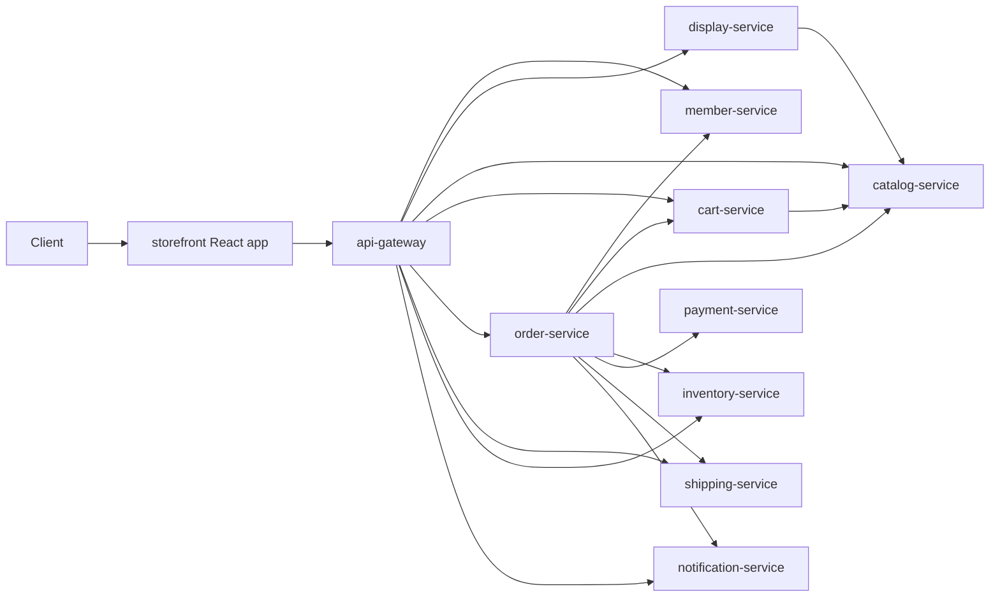
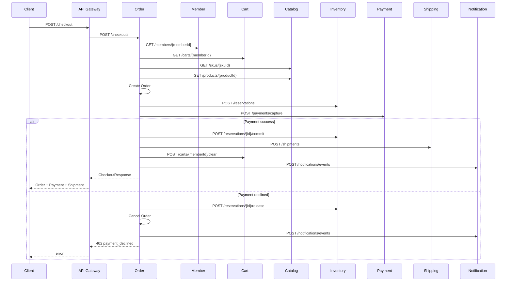

# Architecture

## System View



## Checkout Saga



## Project Architecture

각 마이크로서비스는 다음 모양을 따릅니다.

```text
apps/<service>/
  src/main/java/com/impati/commerce/<domain>/
    <Service>Application.java
    domain/                 # aggregate, entity, value object
    application/            # use case, saga, business flow
    adapter/in/web/         # REST controller
    adapter/out/client/     # downstream HTTP client
    adapter/out/persistence/# repository adapter
    support/                # exception handler 등
```

공통 모듈은 `libs/common-contracts` 하나만 둡니다. 여기에는 서비스 간 HTTP DTO, 공통 예외, ID 생성기만 있고 도메인 모델은 넣지 않았습니다. 도메인 모델을 공유하면 마이크로서비스 경계가 약해지기 때문입니다.

## Transaction Boundary

강한 일관성은 각 서비스 내부 aggregate에만 둡니다. checkout은 분산 트랜잭션이 아니라 saga입니다.

- 재고 예약 성공 후 결제 실패: inventory reservation release
- 결제 성공 후 배송 생성 성공: inventory reservation commit, order fulfilling
- 배송 완료: shipping delivered 후 order delivered

## Next Production Steps

- 서비스별 DB 분리
- Kafka 같은 broker를 통한 domain event 발행
- outbox pattern
- idempotency key for checkout/payment
- Resilience4j retry/circuit breaker
- OpenTelemetry tracing
- Spring Security/OAuth2
- contract test와 consumer-driven contract
